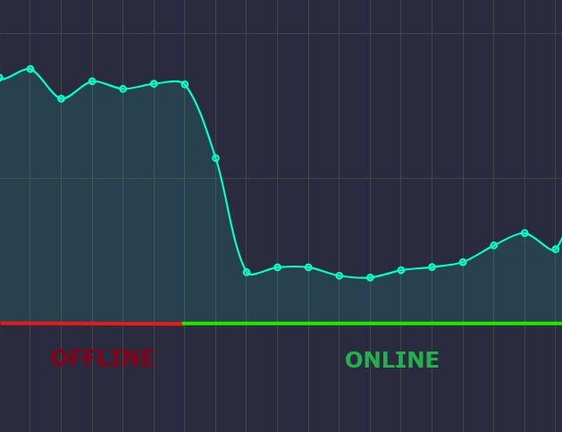

# WhatsApp Latency Tracker

Research tool to monitor WhatsApp network latency and connection states through reaction-based pings. It includes a real-time web dashboard to visualize delays and connection stability.

The script sends a reaction to a fake message ID every 5 seconds. This method is used to get a server receipt without triggering a visible notification on the target's phone. By measuring the time it takes for the server to return an `inactive` status, we get the exact network delay.

The project is built using the [whatsmeow](https://github.com/tulir/whatsmeow) library, a Go implementation of the WhatsApp web API.

---

### Usage Requirements & Limitations

* **Existing Chat**: You must have a <u>recent<u>, active chat history with the target number. Sending pings to a new or empty chat significantly increases the risk of an account ban.
* **Target Device State**: For optimal results, the target should not have WhatsApp active on multiple devices (Web/Desktop), as this can split receipts and produce inconsistent data.
* **Account Safety**: I don't suggest to use your primary WhatsApp account for this. Automated activity can lead to permanent bans. Use a secondary "burner" SIM.

---

**This project is for educational and research purposes only.**

The techniques shown here demonstrate how messaging protocols can be used to:

* Perform timing-based attacks.
* Monitor a user's status (Online, Offline, or Active on phone) by analyzing receipt patterns.
* Gather metadata about a user's network environment.

The author is not responsible for any misuse, account bans, or privacy violations. Use this only on accounts you own or have explicit permission to test.

[More Info](https://media.defcon.org/DEF%20CON%2033/DEF%20CON%2033%20presentations/Gabriel%20Gegenhuber%20Maximilian%20G%C3%BCnther%20-%20Silent%20Signals%20Exploiting%20Security%20and%20Privacy%20Side-Channels%20in%20End-to-End%20Encrypted%20Messengers.pdf)

---

### Example


---

## Setup

### 1. Prerequisites

You need **Go** installed. On Windows, a C compiler (like MinGW) is required for the default SQLite driver.

### 2. Download

```bash
git clone https://github.com/li3less/WhatsappRTTAnalyzer.git
cd WhatsappRTTAnalyzer

```

### 3. Install

```bash
go mod tidy

```

### 4. Configure

Edit `main.go` and update the `phone` variable with the phone number you want to monitor (full international format, without +).

### 5. Run

```bash
go run main.go

```

### 6. Login

Scan the QR code in your terminal using the "Linked Devices" menu in WhatsApp. The web dashboard will open automatically at http://localhost:8080.

---
